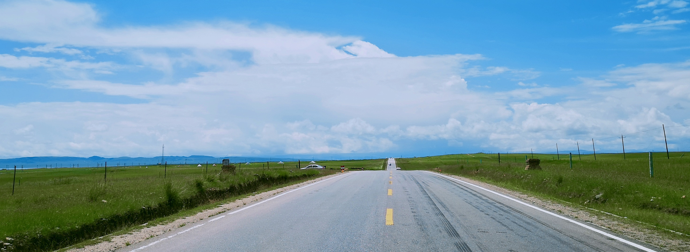

## Intro

Hi, I am **Hao Xu**. I have obtained the bachelor's degree (2018) and the master's degree (2021) from Southeast University, Nanjing, China. Now, I am working on the recommendation model serving (particulaly in GPU-related performance engineering) at Pinduoduo a large e-commerce company in China. My major interests are in Machine Learning, Evolutionary Computing, and Parallel Computing. Here's my [resume](other/files/resume_haoxu.pdf).

## Publications

- **Evolutionary Multitasking**: H. Xu, A. K. Qin and S. Xia, "Evolutionary Multi-task Optimization with Adaptive Knowledge Transfer," IEEE Transactions on Evolutionary Computation, doi: 10.1109/TEVC.2021.3107435.
- **Crowd density estimation**: H. Xu, C. Zheng, Y. Nie and S. Xia, "Crowd Counting with Segmentation Map Guidance," 2019 Chinese Control Conference (CCC), 2019, pp. 7716-7721.

## Work Experiences

- Software Engineer at **Pinduoduo** (07.2021 - present): performance engineer in recommender system (recommendation model serving), particularly, in GPU-related performance engineering.
- Software Intern at **Ant Group **(06.2020 - 08.2020): built a reuseble software framework for multi-objective optimization.  
- Research Intern at **Swinburne University of Technology** (09.2019 - 12.2019, Melbourne, Au): evolutionary multi-task optimization.
- Software Intern at **Nanjing Fujitsu Nanda Software ** (03-2018 - 07-2018): participated in the development of distributed file storage system.

## Projects

- **Vehicle detection in aerial  images**:  An AI competition.  A complex one-stage objection detector Retinanet-Resnext101 (backend by [mmdetection](https://github.com/open-mmlab/mmdetection)) is employed and several tricks (multi-scale training, balanced sampling, etc.) are included to improve the accuracy. After several weeks of hard work, I won the second place out of 132 teams and 5, 000rmb bonus. Here's the [report](other/files/aerial-vehicle-detection.pdf).
- **Coal-gangue sorting system**: A laboratory project. A software system is developed to automatically selecting the gangue from the raw coal mine on the conveyor belt. A fast YOLOv2 detector is used to detect the coal mine on the conveyor belt and a robotic arm is used to grabs the gangue from the conveyor belt. Here's a [demo](images/portfolio/coal-gan/demo.gif).

## Find me
- [github](https://github.com/haoxuhao)
