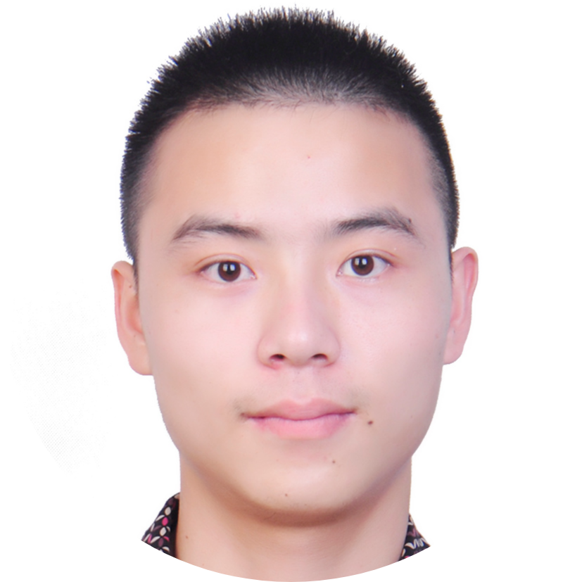

 

     
   <h2>徐浩 | 求职意向：机器学习岗 | 预计毕业时间：2021.06</h2>
     

         
             
             15151869028
         
         ·
         
             
             haoxu96@qq.com
         
         ·
         
             
             <a href="https://github.com/haoxuhao">haoxuhao</a>
         
         ·
         
             
             <a href="https://www.cnblogs.com/walter-xh/"> cnblogs</a>
         
     

 

##  教育经历

- 硕士：东南大学自动化学院，计算机视觉方向，均分83.5/100，top 30%                               2018.09~至今
- 学士：东南大学自动化学院，自动化专业，绩点3.75/4.8，top 15%                                        2014.09~2018.06
- 交流学习：Swinburne University of Technology,  墨尔本                                                        2019.09~2019.12
- 英语：CET4/6 

##  项目经历

- **大规模GPU优化**                                                                  														     2019.09~至今

  多任务演化优化是一种新兴的优化策略旨在同时优化多个相关任务，通过任务之间的知识共享，使得每个任务求解精度更好，收敛更快。提出了一种**去中心化**、**可扩展**、**并行**的多任务优化算法并实现了相应的并行计算框架，框架最多利用**30**个GPU同时优化30个任务。

  **关键技术**：多任务演化算法、MPI、CUDA。

  **结果**：并行求解精度与串行算法相近，加速比达到**2000**倍以上。目前论文在投IJCAI2020。

  

- **人群密度估计**                                                                                                                                 2018.10~2019.01

  提出了一种利用**前景学习**显示地学习人群的整体信息的方式来解决人群密度估计中的背景误检问题。在CSRNet的基础上增加前景学习分支，前景预测结果与密度回归结果掩膜得到最终结果。

  **关键技术**：前景标签生成、密度图回归、图像语义分割。

  **结果**：在ShangHai Tech数据集上精度超过CSRNet，背景误检得到很好抑制，论文发表在[CCC2019](https://ieeexplore.ieee.org/document/8865761/)上。

  

- **航拍车辆检测竞赛**                                                                                                                                 2019.07~2019.09

  检测出无人机航拍图片中的车辆。采用mmdetection中的RetinaNet作为基础算法，利用常用的目标检测技巧提升检测精度。

  **关键技术**：大规模数据集的训练，目标多尺度处理，预测结果后处理。

  **结果**：决赛F1 score达到**91.5%**，成绩2/132，赢得了5000rmb奖金。

  

- **煤矿中的矸石检测**                                                                                                                         2019.04~2019.07 

  采用yolov3-tiny算法检测出传送带上煤矿石中的矸石，将矸石在传送带上的坐标发送给机器人，机器人将矸石从传送带上抓出。

  **关键技术**：数据重采样、预训练模型微调，数据增强，darknek的Windows移植。
  
  **结果**：在实际工业环境中精度达到了**80%**，达到企业预期。

##  实习经历

- **南京富士通南大软件公司，平台事业部门，软件开发实习生**                                                   2018.03~2018.07

  参与分布式统一存储软件[DUS](https://www.fujitsu.com/cn/group/fnst/solution/#title3)(Distributed Unified Storage) 的开发。主要工作：

  1. 文件解密工具开发：实现一个独立于系统之外的文件解密工具，以应对系统死机后的数据恢复。

  2. 文件去重 (File dedup) 功能修复：节点通信从UDS+TCP更改为统一使用TCP通信，该分支功能更加鲁棒。
  

##   获奖

- 2019年“贝式计算杯”信息融合（目标检测与识别）挑战赛一等奖
- 2018年全国研究生数学建模竞赛三等奖
- 2017年全国大学生电子设计竞赛二等奖

##  技能清单

- ★★★ C/C++、Python
- ★★☆ MPI、CUDA、Pytorch
- ★☆☆ Shell、Git、Linux